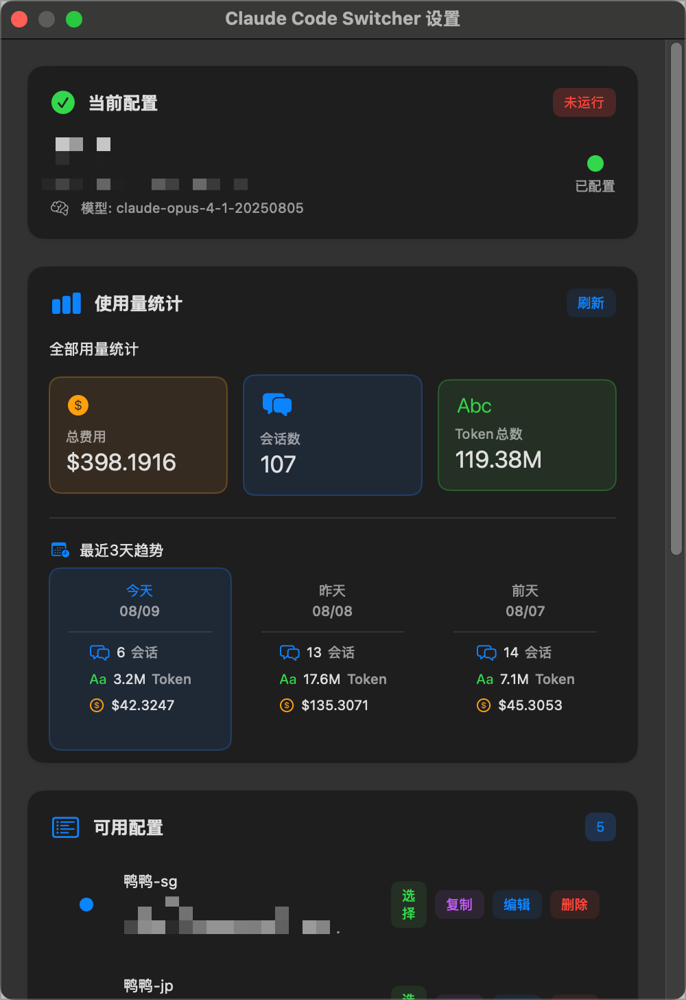
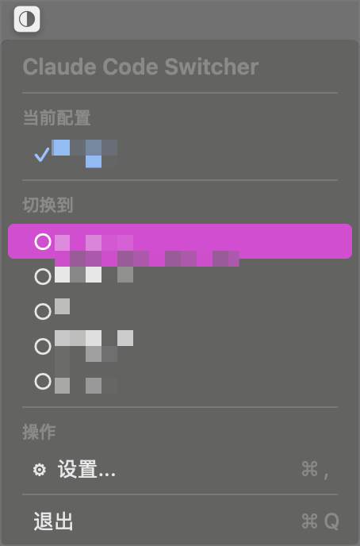

# Claude Code Switcher for macOS

<p align="center">
  
  
  
  
</p>

A lightweight macOS status bar application for managing and quickly switching between multiple Claude Code API provider configurations. Seamlessly integrates with Claude Code by automatically syncing to `~/.claude/settings.json`.

## ✨ Features

- 🔄 **Quick Provider Switching** - Switch between different API providers with a single click from the status bar
- 🎨 **Custom Provider Icons** - Set unique icons for each API provider for easy visual identification
- 📊 **Token Usage Statistics** - Track and visualize API token usage for the last 3 days with detailed breakdowns
- ⚙️ **Auto Configuration Sync** - Automatically syncs with Claude Code's settings.json
- 🌐 **Proxy Support** - Configure HTTP/HTTPS proxy settings per provider
- 🔔 **Switch Notifications** - Get notified when switching between providers
- 🎯 **Native macOS Experience** - Built with SwiftUI for a clean, modern interface

## 📸 Screenshots

<details>
<summary>View Screenshots</summary>

### Settings Window


### Status Bar Menu


</details>

## 🚀 Installation

### Option 1: Download Pre-built Release
1. Download the latest release from the [Releases](https://github.com/yourusername/MacOS-Claude-Code-Switcher/releases) page
2. Unzip the downloaded file
3. Move `ClaudeCodeSwitcher.app` to your Applications folder
4. Launch the app - it will appear in your status bar

### Option 2: Build from Source

#### Prerequisites
- macOS 13.0 or later
- Xcode 14.0 or later
- Swift 5.0 or later

#### Build Steps
```bash
# Clone the repository
git clone https://github.com/yourusername/MacOS-Claude-Code-Switcher.git
cd MacOS-Claude-Code-Switcher

# Build using the provided script
./build.sh

# Or open in Xcode
open ClaudeCodeSwitcher.xcodeproj
# Then press Cmd+B to build and Cmd+R to run
```

## 🎯 Usage

### Getting Started
1. **Launch the app** - The app icon will appear in your macOS status bar
2. **Add API Providers** - Click the status bar icon and select "Settings" to add your API providers
3. **Configure Providers** - For each provider, set:
   - Provider name
   - API Base URL
   - API Key
   - Default models
   - Custom icon (optional)
   - Proxy settings (optional)
4. **Switch Providers** - Click the status bar icon and select any provider to activate it

### Features in Detail

#### Custom Icons
- Right-click on any provider in settings
- Select "Set Custom Icon"
- Choose an image file (PNG, JPG, etc.)
- The icon will appear in the status bar when that provider is active

#### Token Usage Statistics
- Click "Usage Statistics" from the status bar menu
- View detailed token usage for the last 3 days
- See breakdown by model and date
- Track both prompt and completion tokens

#### Proxy Configuration
- In provider settings, expand "Advanced Options"
- Enter HTTP/HTTPS proxy URLs
- Proxy settings are applied per provider

## 🛠 Development

### Project Structure
```
MacOS-Claude-Code-Switcher/
├── App/                    # Application lifecycle and window management
├── Models/                 # Data models (APIProvider, ClaudeConfig)
├── Services/              # Business logic (ConfigManager, TokenStatistics)
├── Views/                 # SwiftUI views and UI components
├── Resources/             # Assets, icons, and Info.plist
└── Tests/                 # Unit and integration tests
```

### Key Technologies
- **SwiftUI** - Modern declarative UI framework
- **AppKit** - Status bar integration
- **Combine** - Reactive programming for state management
- **UserDefaults** - Local configuration storage
- **JSONEncoder/Decoder** - Claude settings synchronization

### Building for Release
```bash
# Create a release build
./build.sh

# Run tests
./test.sh

# The built app will be in build/ClaudeCodeSwitcher.app
```

## 🤝 Contributing

Contributions are welcome! Please feel free to submit a Pull Request.

### How to Contribute
1. Fork the repository
2. Create your feature branch (`git checkout -b feature/AmazingFeature`)
3. Commit your changes (`git commit -m 'Add some AmazingFeature'`)
4. Push to the branch (`git push origin feature/AmazingFeature`)
5. Open a Pull Request

### Development Guidelines
- Follow Swift naming conventions and style guidelines
- Add tests for new features
- Update documentation as needed
- Ensure the app builds without warnings

## 📝 Requirements

- **macOS**: 13.0 (Ventura) or later
- **Storage**: ~10 MB
- **Claude Code**: Compatible with all versions that use `~/.claude/settings.json`

## 🔧 Troubleshooting

### App doesn't appear in status bar
- Check if the app is running in Activity Monitor
- Try restarting the app
- Ensure you have granted necessary permissions

### Configuration not syncing with Claude Code
- Verify `~/.claude/settings.json` exists
- Check file permissions
- Restart both Claude Code Switcher and Claude Code

### Custom icons not displaying
- Ensure image files are in supported formats (PNG, JPG, HEIC)
- Try using smaller image files (< 1MB recommended)
- Reset the icon and set it again

## 📄 License

This project is licensed under the MIT License - see the [LICENSE](LICENSE) file for details.

## 🙏 Acknowledgments

- Built for the [Claude Code](https://claude.ai/code) community
- Inspired by the need for quick API provider switching
- Thanks to all contributors and users

## 📮 Contact & Support

- **Issues**: [GitHub Issues](https://github.com/yourusername/MacOS-Claude-Code-Switcher/issues)
- **Discussions**: [GitHub Discussions](https://github.com/yourusername/MacOS-Claude-Code-Switcher/discussions)

---

<p align="center">
  Made with ❤️ for the Claude Code community
</p>